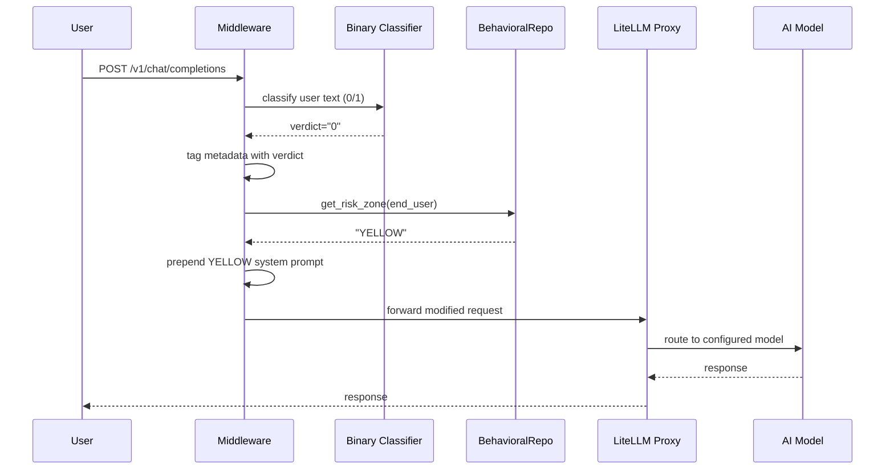
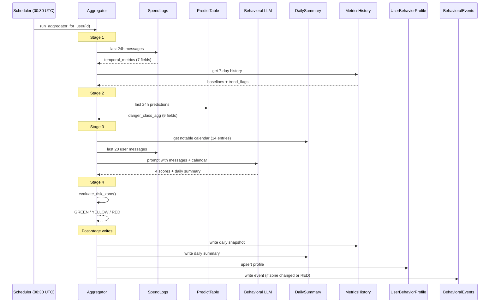
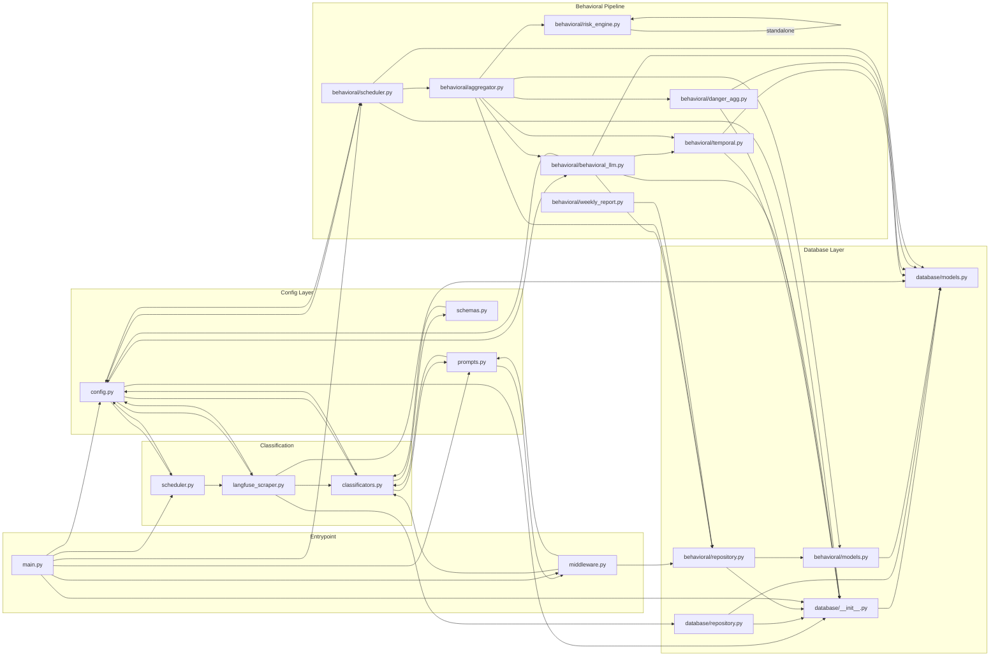

# Code Review: ai-safety-dev/src/

**Date:** 2026-03-24 (updated)
**Scope:** All Python files in `ai-safety-dev/src/` (21 files)
**Tests:** 91 passing

---

## System Architecture

```mermaid
graph TB
    subgraph "External Services"
        LF[Langfuse API]
        OR[OpenRouter / Ollama]
        PG[(PostgreSQL)]
    end

    subgraph "LiteLLM Proxy Server"
        MW[middleware.py<br/>Binary Classification<br/>+ Risk Zone Injection]
        PROXY[LiteLLM Proxy<br/>litellm.proxy.proxy_server]
    end

    subgraph "Langfuse Scraper Pipeline"
        LS_SCHED[scheduler.py<br/>Hourly APScheduler]
        LS[langfuse_scraper.py<br/>Fetch traces + classify]
        CLASS[classificators.py<br/>Binary + Multi-label]
    end

    subgraph "Behavioral Monitoring Pipeline"
        BS[behavioral/scheduler.py<br/>Daily 00:30 UTC]
        AGG[behavioral/aggregator.py<br/>4-stage orchestrator]
        S1[behavioral/temporal.py<br/>Stage 1: 7 temporal metrics]
        S2[behavioral/danger_agg.py<br/>Stage 2: 5 danger classes]
        S3[behavioral/behavioral_llm.py<br/>Stage 3: LLM scores + summary]
        S4[behavioral/risk_engine.py<br/>Stage 4: GREEN/YELLOW/RED]
        WR[behavioral/weekly_report.py<br/>Weekly report generator]
    end

    subgraph "Data Layer"
        DB_INIT[database/__init__.py<br/>Engine + Session]
        MODELS[database/models.py<br/>~30 SQLAlchemy models]
        PREPO[database/repository.py<br/>PredictRepository]
        BREPO[behavioral/repository.py<br/>BehavioralRepository]
        BMOD[behavioral/models.py<br/>4 behavioral tables]
    end

    subgraph "Configuration"
        CFG[config.py<br/>Settings via pydantic]
        YAML[config.yaml<br/>LiteLLM model routing]
        SCH[schemas.py<br/>Pydantic response models]
        PROM[prompts.py<br/>LLM policy prompts]
    end

    %% Request flow
    USER((User)) -->|POST /v1/chat/completions| MW
    MW -->|binary classify| CLASS
    MW -->|risk_zone lookup| BREPO
    MW --> PROXY
    PROXY -->|route to model| OR

    %% Langfuse scraper flow
    LS_SCHED -->|hourly| LS
    LS -->|fetch traces| LF
    LS -->|multi-label classify| CLASS
    LS -->|write predictions| PREPO
    CLASS -->|call judge model| OR

    %% Behavioral pipeline flow
    BS -->|daily per user| AGG
    AGG --> S1
    AGG --> S2
    AGG --> S3
    AGG --> S4
    S1 -->|read SpendLogs| PG
    S2 -->|read PredictTable| PG
    S3 -->|call LLM| OR
    S3 -->|read calendar| BREPO
    S4 -->|read history| BREPO
    AGG -->|write results| BREPO
    WR -->|read all tables| BREPO

    %% Data layer
    PREPO --> PG
    BREPO --> PG
    DB_INIT --> PG

    %% Config
    CFG -.-> MW
    CFG -.-> LS
    CFG -.-> S3
    CFG -.-> DB_INIT
    YAML -.-> PROXY
    SCH -.-> CLASS
    PROM -.-> CLASS
    PROM -.-> MW
```

---

## Data Flow: Request Lifecycle

## Data Flow: Daily Behavioral Pipeline

---

## File Dependencies

---

## Per-File Review

### Configuration & Schemas

#### config.py (34 lines)

**Purpose:** Centralized app settings via `pydantic-settings` with environment variable binding.

**Key exports:** `Settings` class, `settings` singleton

**Workflow:** Loaded at import time. Every module that needs DB credentials, API keys, or model names imports `settings`. Env vars like `DB_HOST`, `API_KEY`, `JUDGE_MODEL`, `BEHAVIORAL_LLM_MODEL` are read from the OS environment.

**Dependencies:** `pydantic-settings`

**Status:** Production-ready. No issues.

---

#### schemas.py (19 lines)

**Purpose:** Pydantic response models for the multi-label safety classifier.

**Key exports:** `LabelConfidence`, `SafetyMultilabel` (5 danger classes), `SafetyMultilabelSchema`

**Workflow:** Used by `classificators.py` as `response_format` for structured LLM output. The 5 classes (`self_harm`, `psychosis`, `delusion`, `obsession`, `anthropomorphism`) match what `danger_agg.py` reads from PredictTable.

**Dependencies:** `pydantic`

**Status:** Production-ready. No issues.

---

#### prompts.py (327 lines)

**Purpose:** Policy prompts for binary and multi-label LLM safety classification.

**Key exports:** `POLICY` (binary 0/1 prompt), `MULTI_LABEL_POLICY_PROMPT`, `MULTI_LABEL_POLICY_PROMPT_SYCOPHANCY`

**Workflow:** `POLICY` is injected into the middleware for per-request binary classification. `MULTI_LABEL_POLICY_PROMPT` is used by the Langfuse scraper for daily multi-label classification.

**Dependencies:** None (pure text)

**Status:** Needs cleanup.
- `MULTI_LABEL_POLICY_PROMPT_SYCOPHANCY` adds a `sycophancy` field not in `SafetyMultilabel` schema. Currently unused (dead code) but would break if activated.
- Heavy duplication between the two multi-label prompts.

---

### Entrypoint & Middleware

#### main.py (49 lines)

**Purpose:** Application entrypoint. Wires LiteLLM proxy with safety middleware, database bootstrap, and both schedulers.

**Key exports:** `litellm_app`, `wrapped_lifespan`

**Workflow:**
1. Imports the LiteLLM proxy app
2. Attaches `BinaryUserSafetyGuardrailMiddleware` (binary classification + risk zone injection)
3. Wraps the lifespan to: create DB tables -> start Langfuse scheduler -> start behavioral scheduler
4. On shutdown: gracefully stops both schedulers

**Dependencies:** `config`, `database`, `middleware`, `prompts`, `scheduler`, `behavioral.scheduler`

**Status:** Production-ready. Uses `settings.JUDGE_MODEL` for model config (fixed).

---

#### middleware.py (193 lines)

**Purpose:** Starlette middleware that performs binary safety classification on every request AND injects risk-zone-based safety prompts for YELLOW/RED users.

**Key exports:** `BinaryUserSafetyGuardrailMiddleware`, `_inject_risk_zone_prompt`

**Workflow (per request):**
1. Check if request matches allowlisted path/method (`POST /v1/chat/completions`)
2. Parse JSON body, extract last user message
3. Call binary classifier via `input_classification()` -> tag verdict in metadata
4. Look up user's `risk_zone` from `UserBehaviorProfile` via `BehavioralRepository`
5. If YELLOW/RED: prepend fixed safety system message to messages array
6. Forward modified request to LiteLLM proxy

**Dependencies:** `classificators`, `prompts`, `behavioral.repository`

**Status:** Production-ready (after fixes).
- `_extract_user_text` now returns `""` instead of `None` (fixed).
- `_openai_error` method is dead code — middleware only classifies and tags, never blocks. Could be removed but harmless.

---

### Classification Layer

#### classificators.py (72 lines)

**Purpose:** Async wrappers for binary (0/1) and multi-label LLM safety classification.

**Key exports:** `input_classification` (binary), `daily_classification` (multi-label)

**Workflow:**
- `input_classification`: Called by middleware per request. Sends user text + policy prompt to judge model, returns "0" (safe) or "1" (unsafe). Fail-open: returns "0" on timeout/error.
- `daily_classification`: Called by Langfuse scraper. Sends full conversation to judge model with structured output (`SafetyMultilabelSchema`), returns 5-class labels with confidence scores.

**Dependencies:** `litellm`, `config`, `prompts`, `schemas`

**Status:** Production-ready (after fix). Demo block now uses correct function signature.

---

#### scheduler.py (34 lines)

**Purpose:** APScheduler job that triggers Langfuse session scraping on a timer.

**Key exports:** `start_langfuse_scheduler`

**Workflow:** Creates a single scheduled job that calls `scrape_sessions_for_previous_hour`. In production: hourly via `IntervalTrigger`. In dev mode: every 5 seconds via `CronTrigger`.

**Dependencies:** `config`, `langfuse_scraper`

**Status:** Production-ready (after fix). Now schedules one global job instead of broken per-user jobs.

---

#### langfuse_scraper.py (187 lines)

**Purpose:** Fetches conversation traces from Langfuse HTTP API and runs multi-label classification on new sessions.

**Key exports:** `scrape_sessions_for_previous_hour`

**Workflow:**
1. Compute time window (last N hours based on `SCRAPE_HOURS_WINDOW`)
2. Fetch traces from Langfuse API, extract unique session IDs
3. For each session: get traces, find latest, extract user ID from metadata
4. If session not already classified (or new trace): run `daily_classification`
5. Store result in `LiteLLM_PredictTable` (consumed by Stage 2)

**Dependencies:** `httpx`, `classificators`, `config`, `database.models`, `database.repository`

**Status:** Production-ready (after fixes). Error handling added for nested metadata access. Each session processed in try/except.

---

### Database Layer

#### database/\_\_init\_\_.py (25 lines)

**Purpose:** Creates async SQLAlchemy engine, session factory, and schema bootstrap function.

**Key exports:** `engine`, `Session` (async_sessionmaker), `create_all_schemas`

**Workflow:** Engine connects to PostgreSQL via `asyncpg`. `create_all_schemas()` is called once at startup from `main.py` lifespan. It lazily imports `behavioral.models` to register the 4 behavioral tables with `Base.metadata` before calling `create_all`.

**Dependencies:** `config`, `database.models`, `behavioral.models` (lazy)

**Status:** Production-ready.
- `asyncio.sleep(1)` exists as a startup timing workaround. Harmless but undocumented.

---

#### database/models.py (~920 lines)

**Purpose:** SQLAlchemy ORM models mirroring the LiteLLM schema + custom `LiteLLM_PredictTable`.

**Key exports:** `Base`, `LiteLLM_UserTable`, `LiteLLM_SpendLogs`, `LiteLLM_PredictTable`, ~20 other LiteLLM tables

**Workflow:** Defines the `Base` declarative class with naming conventions. All tables inherit from `Base`. The behavioral models import `Base` from here.

**Dependencies:** `sqlalchemy`

**Status:** Production-ready. Large file (LiteLLM schema copies) but stable.

---

#### database/repository.py (55 lines)

**Purpose:** Data access layer for `LiteLLM_PredictTable`.

**Key exports:** `PredictRepository`

**Workflow:** Used by `langfuse_scraper.py` to write classification results and check for existing predictions. Used by `scheduler.py` (indirectly, via the scraper) to access prediction data.

**Dependencies:** `database` (Session), `database.models`

**Status:** Production-ready (after fixes). Session factory pattern fixed. `created_at` now selected in `last_time_recorded_by_all_users`. Redundant `commit()` removed.

---

### Behavioral Monitoring Module

#### behavioral/models.py (89 lines)

**Purpose:** 4 SQLAlchemy models for the behavioral monitoring system.

**Key exports:**
- `UserBehaviorProfile` — current risk state per user (PK: end_user_id)
- `MetricsHistory` — daily timestamped snapshots for trends
- `DailySummary` — structured narrative per user per day (unique on user+date)
- `BehavioralEvent` — threshold crossings for alerts/audit

**Workflow:** Created by `database/__init__.py:create_all_schemas()` at startup. Written by the aggregator, read by middleware (risk_zone lookup), weekly report, and Stage 3 (calendar).

**Dependencies:** `database.models` (Base)

**Status:** Production-ready. All columns match the v3 spec exactly.

---

#### behavioral/repository.py (180 lines)

**Purpose:** Data access layer for all 4 behavioral tables with date-range queries.

**Key exports:** `BehavioralRepository` with 12 methods:
- Profile: `get_profile`, `upsert_profile`, `get_risk_zone`
- History: `add_metrics_history`, `get_recent_metrics`, `get_metrics_in_range`
- Summary: `add_daily_summary`, `get_notable_calendar`, `get_notable_summaries_in_range`
- Events: `add_event`, `get_recent_events`, `get_events_in_range`

**Workflow:** Used by aggregator (write all tables), middleware (read risk_zone), Stage 3 (read calendar + carry-forward), weekly report (read all tables).

**Dependencies:** `database` (Session), `behavioral.models`

**Status:** Production-ready. Fresh session per method call. Upsert via `merge()` for profile and daily summary.

---

#### behavioral/aggregator.py (146 lines)

**Purpose:** Main 4-stage daily pipeline orchestrator.

**Key exports:** `run_aggregator_for_user`

**Workflow:**
1. Stage 1: `compute_temporal_metrics()` -> 7 temporal metrics from SpendLogs
2. Compute baselines (7-day rolling avg from MetricsHistory) + trend flags
3. Stage 2: `compute_danger_class_agg()` -> 9 danger metrics from PredictTable
4. Stage 3: `compute_behavioral_scores_and_summary()` -> 4 scores + daily summary via LLM
5. Stage 4: `evaluate_risk_zone()` -> GREEN/YELLOW/RED from all inputs
6. Write: MetricsHistory, DailySummary, UserBehaviorProfile, BehavioralEvent (on zone change or RED)

**Dependencies:** All 4 stage modules, `behavioral.repository`, `behavioral.models`

**Status:** Production-ready.
- `_compute_is_notable()` implements all 5 calendar filtering rules from spec.
- Events emitted on zone change OR repeated RED (spec compliant).

---

#### behavioral/temporal.py (185 lines)

**Purpose:** Stage 1 — compute 24h temporal usage metrics from SpendLogs.

**Key exports:** `compute_temporal_metrics`, `compute_baselines`, `compute_trend_flags`, `_extract_last_user_message`

**7 metrics computed:**
| Metric | Field | Window |
|--------|-------|--------|
| Message count | `daily_message_count` | 24h |
| Hourly histogram | `activity_by_hour` | 24h |
| Night messages | `night_messages` | 24h (hours 22,23,0,1,2,3) |
| Active hours | `daily_active_hours` | 24h |
| Avg prompt length | `avg_prompt_length_chars` | 24h |
| Inter-message interval | `avg_inter_message_interval_min` | 24h |
| Burst detection | `messages_last_1h` | 1h |

**Workflow:** Queries `LiteLLM_SpendLogs` for last 24h, extracts last user message from each cumulative `messages` JSON array, computes all metrics in Python.

**Dependencies:** `database` (Session), `database.models` (LiteLLM_SpendLogs)

**Status:** Production-ready.
- `_extract_last_user_message` is also used by `behavioral_llm.py` (cross-module import of private function — works but noted).

---

#### behavioral/danger_agg.py (130 lines)

**Purpose:** Stage 2 — aggregate 24h danger-class scores from PredictTable.

**Key exports:** `compute_danger_class_agg`

**9 metrics computed:**
| Metric | Classes |
|--------|---------|
| avg confidence | all 5 classes |
| max confidence | self_harm only |
| flag rate (% label=1) | self_harm, delusion |
| max class avg | MAX across all 5 avgs |

**Workflow:** Queries `LiteLLM_PredictTable` for last 24h, parses nested `predict` JSON, aggregates per-class statistics.

**Dependencies:** `database` (Session), `database.models` (LiteLLM_PredictTable)

**Status:** Production-ready.

---

#### behavioral/behavioral_llm.py (245 lines)

**Purpose:** Stage 3 — call LLM to produce 4 behavioral scores + structured daily summary.

**Key exports:** `compute_behavioral_scores_and_summary`

**Workflow:**
1. Fetch last 20 user messages from SpendLogs (within 7 days)
2. Fetch notable calendar entries (up to 14) from DailySummary
3. Build prompt with date + messages + calendar
4. Call LLM via `litellm.acompletion(model=BEHAVIORAL_LLM_MODEL)`
5. Parse JSON response, validate all score keys, clamp 0-1, fill missing summary defaults
6. On failure: carry forward previous scores from MetricsHistory

**4 behavioral scores:** `topic_concentration`, `decision_delegation`, `social_isolation`, `emotional_attachment`

**6 summary fields:** `key_topics`, `life_events`, `emotional_tone`, `ai_relationship_markers`, `notable_quotes`, `operator_note`

**Dependencies:** `litellm`, `config`, `database`, `behavioral.repository`, `behavioral.temporal`

**Status:** Production-ready.
- LLM call uses `settings.BEHAVIORAL_LLM_MODEL` — configurable to Ollama, OpenRouter, OpenWebUI, etc.
- `litellm.acompletion` relies on LiteLLM's global router config for credentials (set via `config.yaml`).

---

#### behavioral/risk_engine.py (112 lines)

**Purpose:** Stage 4 — rule-based risk zone engine mapping metrics to GREEN/YELLOW/RED.

**Key exports:** `evaluate_risk_zone`

**Rules:**
- **YELLOW (any 2):** night_messages > 24, daily_msgs > 50 + trending up, max_class_avg > 0.3, topic_concentration > 0.7, decision_delegation > 0.4, interval shrinking > 30%
- **RED (any 1):** self_harm_flag_rate > 0.3 OR max > 0.8, active_hours > 6, msgs > 200, sustained YELLOW >= 3 days, isolation > 0.6 AND attachment > 0.5
- RED overrides YELLOW

**Dependencies:** None (standalone logic). Async for future extensibility (v2 may use LLM).

**Status:** Production-ready. All thresholds hardcoded per spec.

---

#### behavioral/weekly_report.py (170 lines)

**Purpose:** Generates weekly plain-text reports from DB data. No LLM call.

**Key exports:** `generate_weekly_report`

**Report sections:**
1. **Header** — user ID, date range, current risk zone
2. **Stats** — 6 metrics with week-over-week comparison (messages, night, hours, length, self-harm, psychosis)
3. **Notable days** — timeline from DailySummary (topics, events, tone, quotes, operator notes)
4. **Behavioral scores** — latest topic_concentration, isolation, attachment, delegation
5. **Risk transitions** — zone changes from BehavioralEvents

**Dependencies:** `behavioral.repository`

**Status:** Production-ready. Not yet wired into a scheduler or endpoint — generation must be triggered manually.

---

#### behavioral/scheduler.py (68 lines)

**Purpose:** APScheduler job that discovers active users and runs the behavioral aggregator daily.

**Key exports:** `start_behavioral_scheduler`

**Workflow:**
1. On trigger: query SpendLogs for distinct `end_user` IDs active in last 48h
2. For each user: call `run_aggregator_for_user(user_id)` with per-user error handling
3. Production: runs daily at 00:30 UTC. Dev mode: every 30 seconds.

**Dependencies:** `config`, `database` (Session), `database.models`, `behavioral.aggregator`

**Status:** Production-ready. Sequential user processing (could be parallelized for scale, but fine for thesis scope).

---

## Dependencies (pyproject.toml)

| Package | Version | Used by |
|---------|---------|---------|
| litellm[proxy] | 1.81.8 | Proxy server, LLM calls (all classification + behavioral LLM) |
| sqlalchemy[asyncio] | >=2.0.48 | All database access |
| asyncpg | >=0.31.0 | PostgreSQL async driver |
| pydantic | 2.12.5 | Settings, schemas, response validation |
| pydantic-settings | 2.12.0 | Environment variable config |
| apscheduler | 3.11.2 | Both schedulers (Langfuse hourly + behavioral daily) |
| fastapi | 0.128.4 | Underlying web framework (via LiteLLM) |
| langfuse | >=2.0,<3.0 | Tracing + observability |
| httpx | (via litellm) | Langfuse API HTTP client |
| uvicorn | 0.31.1 | ASGI server |

**Test dependencies:** pytest, pytest-asyncio, aiosqlite (in-memory SQLite for tests)

---

## Known Remaining Items

| # | Severity | File | Issue |
|---|----------|------|-------|
| 1 | Minor | prompts.py | `MULTI_LABEL_POLICY_PROMPT_SYCOPHANCY` is dead code with schema mismatch. Safe to remove. |
| 2 | Minor | middleware.py | `_openai_error` method is dead code. Middleware never blocks, only tags + injects. |
| 3 | Minor | database/__init__.py | `asyncio.sleep(1)` startup workaround undocumented. |
| 4 | Enhancement | weekly_report.py | Not wired into scheduler/endpoint — must be triggered manually. |
| 5 | Enhancement | risk_engine.py | Function is `async` with no `await` — intentional for v2 extensibility. |
| 6 | Enhancement | behavioral/scheduler.py | Sequential user processing — `asyncio.gather` would help at scale. |
